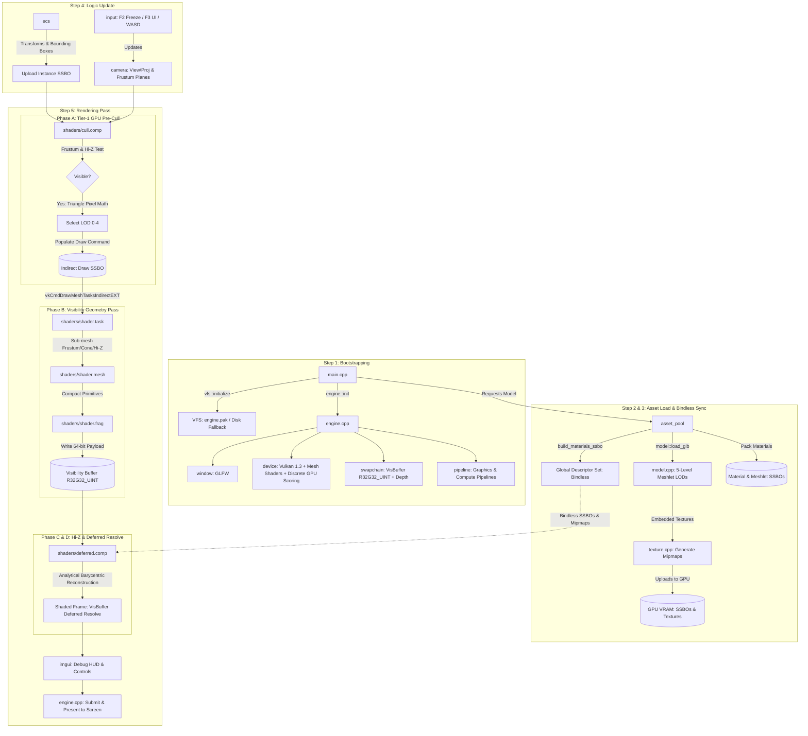

```mermaid
graph TD
    %% Step 1
    subgraph Step 1: Bootstrapping
        Main1[main.cpp] -->|vfs::initialize| VFS[VFS: engine.pak / Disk Fallback]
        Main1 -->|engine::init| Engine[engine.cpp]
        Engine --> Win[window: GLFW]
        Engine --> Dev[device: Vulkan 1.3 + Mesh Shaders + Discrete GPU Scoring]
        Engine --> Swap[swapchain: VisBuffer R32G32_UINT + Depth]
        Engine --> Pipe[pipeline: Graphics & Compute Pipelines]
    end

    %% Step 2 & 3
    subgraph Step 2 & 3: Asset Load & Bindless Sync
        Main1 -->|Requests Model| Pool[asset_pool]
        Pool -->|model::load_glb| Mod[model.cpp: 5-Level Meshlet LODs]
        Mod -->|Embedded Textures| Tex[texture.cpp: Generate Mipmaps]
        Tex -->|Uploads to GPU| VRAM[(GPU VRAM: SSBOs & Textures)]
        
        Pool -->|build_materials_ssbo| Desc[Global Descriptor Set: Bindless]
        Pool -->|Pack Materials| SSBO[(Material & Meshlet SSBOs)]
    end

    %% Step 4
    subgraph Step 4: Logic Update
        Inp[input: F2 Freeze / F3 UI / WASD] -->|Updates| Cam[camera: View/Proj & Frustum Planes]
        ECS[ecs] -->|Transforms & Bounding Boxes| Instances[Upload Instance SSBO]
    end

    %% Step 5
    subgraph Step 5: Rendering Pass
        %% Phase A
        subgraph Phase A: Tier-1 GPU Pre-Cull
            Instances --> CullComp[shaders/cull.comp]
            Cam --> CullComp
            CullComp -->|Frustum & Hi-Z Test| CullDecide{Visible?}
            CullDecide -->|Yes: Triangle Pixel Math| PickLOD[Select LOD 0-4]
            PickLOD -->|Populate Draw Command| IndBuffer[(Indirect Draw SSBO)]
        end

        %% Phase B
        subgraph Phase B: Visibility Geometry Pass
            IndBuffer -->|vkCmdDrawMeshTasksIndirectEXT| TaskSh[shaders/shader.task]
            TaskSh -->|Sub-mesh Frustum/Cone/Hi-Z| MeshSh[shaders/shader.mesh]
            MeshSh -->|Compact Primitives| FragSh[shaders/shader.frag]
            FragSh -->|Write 64-bit Payload| VisBuf[(Visibility Buffer R32G32_UINT)]
        end

        %% Phase C & D
        subgraph Phase C & D: Hi-Z & Deferred Resolve
            VisBuf --> DefComp[shaders/deferred.comp]
            Desc -.->|Bindless SSBOs & Mipmaps| DefComp
            DefComp -->|Analytical Barycentric Reconstruction| ShadedFrame[Shaded Frame: VisBuffer Deferred Resolve]
        end

        ShadedFrame --> UI[imgui: Debug HUD & Controls]
        UI --> Present[engine.cpp: Submit & Present to Screen]
    end
```
